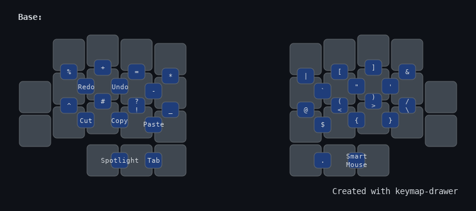
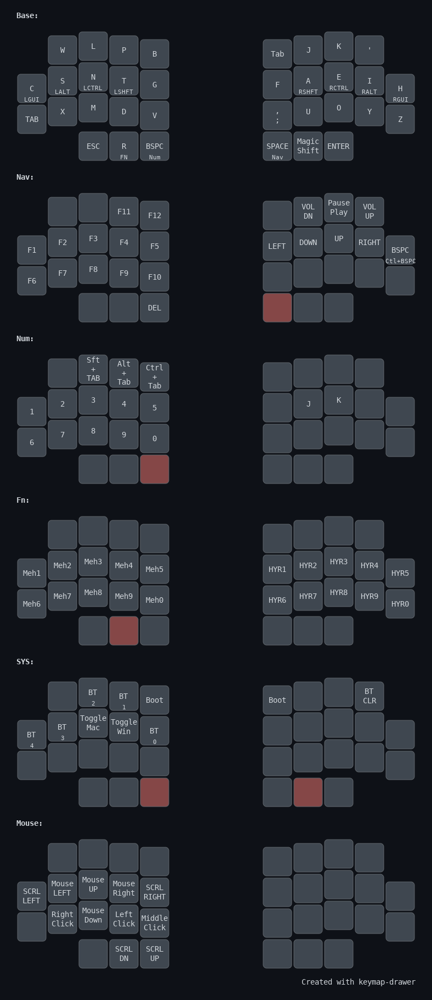

#  ZMK config
ZMK config for my ergonomic keyboards. It focuses around my custom keyboard the catpucciano with a 34 key layout 

  
  

## Keymap 
- Incorporates many features from [urob's config](https://github.com/urob/zmk-config)
    - Timeless Homerow Mods
    - Magic Shift
    - Smart Mouse
    - Alt-tab swapper with [tri-state](https://github.com/dhruvinsh/zmk-tri-state)
- Combos are placed in ways I found the most comfortable while maximizing rolling for frequent keys(Ex,+=, <>)
    - I found vertical combos easier to hit than horizontal combos, thus I placed the most common symbols on vertical combos 
    - Horizontal combos is only used on the left hand for clipboard function

## Combos

## Layout

